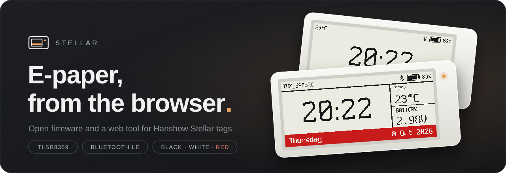
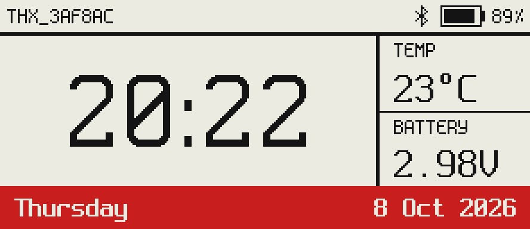
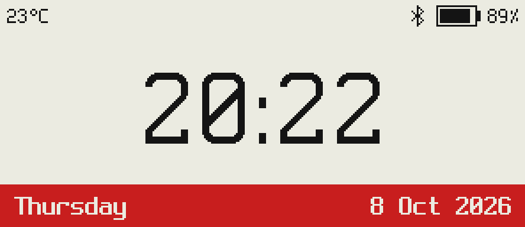
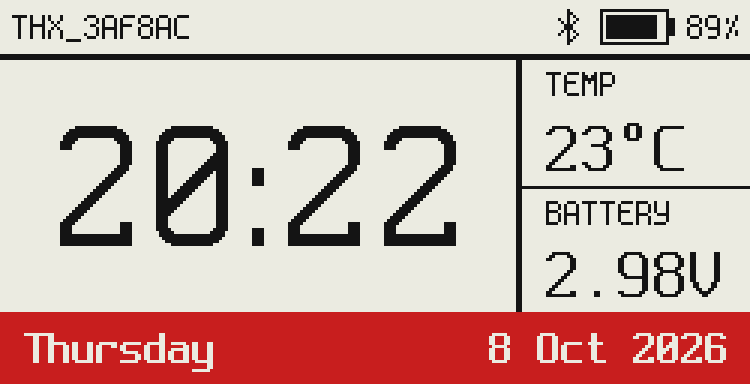
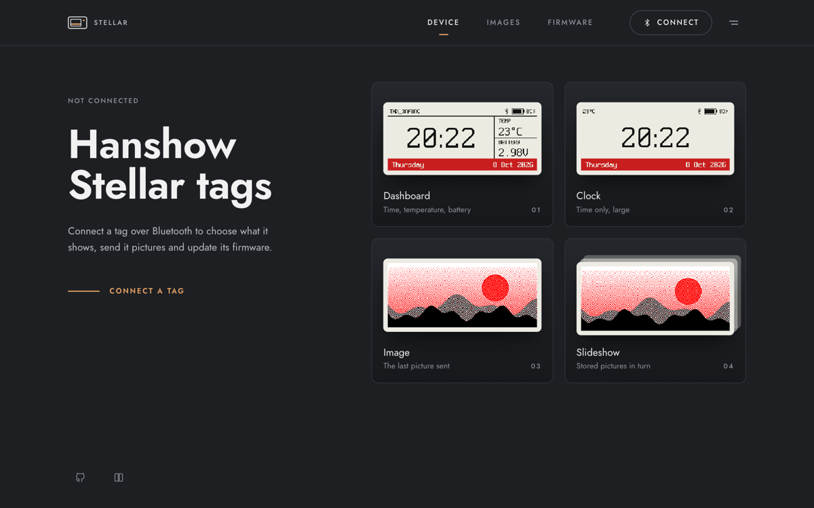
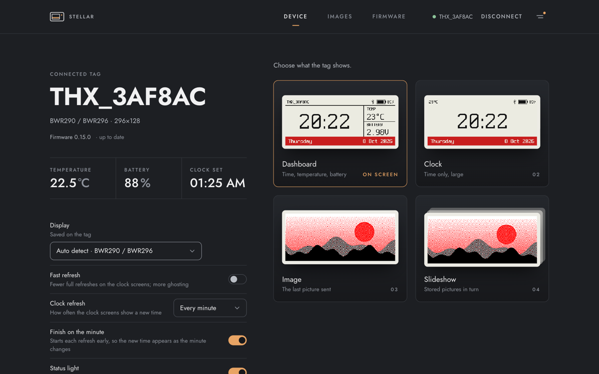
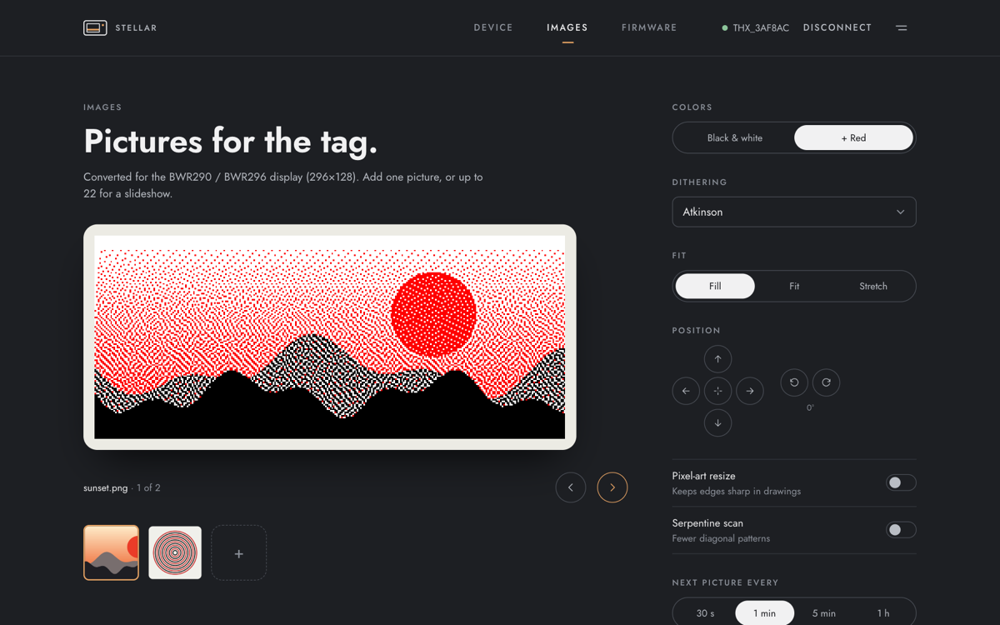
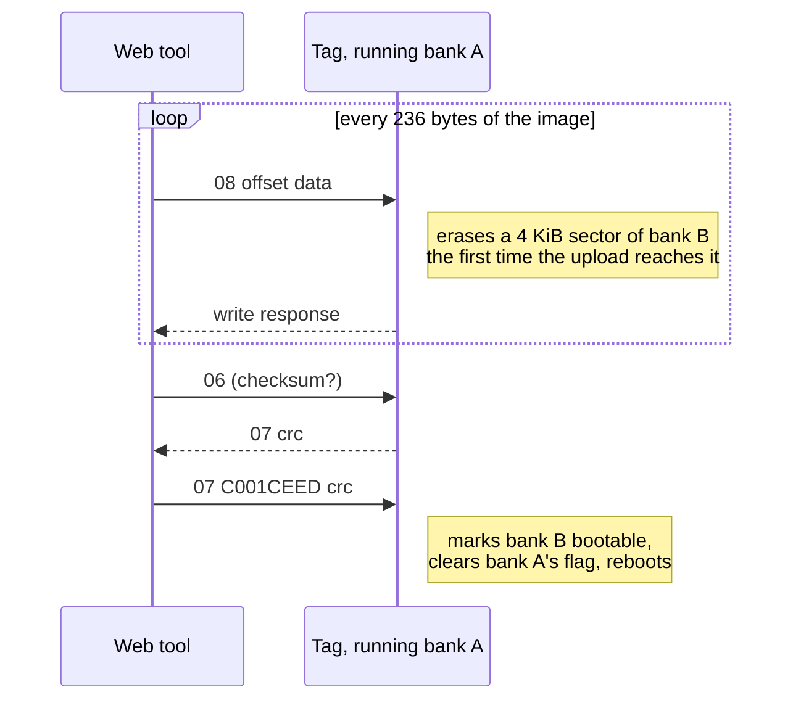

<div align="center">



[](https://github.com/dene-/stellar-L3N-etag/releases/latest)
[](https://github.com/dene-/stellar-L3N-etag/actions/workflows/firmware-release.yml)
[](https://dene-.github.io/stellar-L3N-etag/)

<h3>
  <a href="https://dene-.github.io/stellar-L3N-etag/">Open the web tool</a>
  ·
  <a href="#getting-started">Getting started</a>
  ·
  <a href="#bluetooth-protocol">Protocol</a>
  ·
  <a href="#building">Building</a>
</h3>

Custom firmware for **Hanshow Stellar** electronic shelf labels, built on the Telink TLSR8359
Bluetooth chip, and a web tool that manages them from Chrome or Edge.

</div>

## Features

- **Screens**: a dashboard (time, temperature, battery), a large clock, the last picture sent, or
  a slideshow. The panel is only redrawn when the picture changed.
- **Pictures**: dithered in the browser for the panel's colors, up to 22 stored on the tag. The
  slideshow interval can be changed without uploading again.
- **No app**: the web tool uses Web Bluetooth; the first install uses Web Serial and a USB serial
  adapter.
- **Dual-bank updates**: an update is written next to the running firmware and only started once
  its checksum matches.
- **Timekeeping**: time zone and daylight saving rules for the next years, and a drift correction
  measured at every sync.
- **Sensor advertising**: temperature, battery percentage and voltage in the ATC1441 format,
  readable without connecting.

## Screens

<table>
  <tr>
    <td align="center"></td>
    <td align="center"></td>
    <td align="center"></td>
  </tr>
  <tr>
    <td align="center"><sub><b>Dashboard</b> · 2.9"</sub></td>
    <td align="center"><sub><b>Clock</b> · 2.9"</sub></td>
    <td align="center"><sub><b>Dashboard</b> · 2.13"</sub></td>
  </tr>
</table>

<sub>Rendered by <code>tools/scene_preview</code> from the same code that runs on the tag.</sub>

## Web tool

<table>
  <tr>
    <td align="center"><a href="images/web-home.png"></a></td>
    <td align="center"><a href="images/web-device.png"></a></td>
    <td align="center"><a href="images/web-images.png"></a></td>
  </tr>
  <tr>
    <td align="center"><sub><b>Start</b></sub></td>
    <td align="center"><sub><b>Device</b></sub></td>
    <td align="center"><sub><b>Images</b></sub></td>
  </tr>
</table>

Open <https://dene-.github.io/stellar-L3N-etag/> in Chrome or Edge. Connecting opens the browser's
Bluetooth picker, which lists only tags (names starting with `THX`).

- **Device**: what the tag shows (all four screens as cards; the one on the tag is marked "On
  screen"), its name, firmware version, temperature and battery, the display model and the status
  light. The other settings follow the screen on the tag: on the clock screens how often and when
  the clock refreshes and fast refresh, on the image and slideshow screens how many pictures are
  stored, and in the slideshow how long each picture stays (changed without uploading again, from
  v0.14.0). Connecting also sets the tag's clock and time zone.
- **Images**: converts pictures for the panel with a choice of dithering, and sends one picture or
  a slideshow. Pictures can be prepared before connecting.
- **Firmware**: shows the version on the tag and whether a newer release exists, and installs a
  release (or a `.bin` file of your own) over Bluetooth, or over a USB serial adapter.

The log of everything sent to and received from the tag opens from the icon at the top right. To
run the tool locally, with Node 22.17 or later: `cd web_tools && yarn install && yarn dev`.

> [!NOTE]
> Firmware up to v0.11.0 reports its name as just `THX` once connected (the GAP Device Name), and
> browsers remember it, so such a tag shows up as `THX` instead of `THX_` plus its MAC address. From
> v0.12.0 on it reports the full name; the browser may keep showing `THX` until it reads the name
> again.

## Supported tags

| Tag | Panel | Tested on hardware |
| --- | --- | :---: |
| Stellar L3N@ 2.9" | BWR296, 296×128, black/white/red | ✓ |
| Stellar Pro 213R-N | BWR213, 250×122, black/white/red | ✓ |
| Stellar 213Q-N (experimental) | BWRY213, 250×122, black/white/red/yellow | |
| Other Stellar tags with these panels | see [Display models](#display-models) | |

The Stellar 213Q-N (four-colour panel, JD79661 controller) sits on a newer Hanshow board whose panel
is wired to different pins. Bluetooth works on it with any model, but the screen only refreshes once
model 7 is selected on the Device page, which switches the firmware to that wiring. The wiring and
the panel driver come from other projects' work on the same board generation and have not been
confirmed on a 213Q-N yet.

`Compatible_models/` has photos of other Stellar variants.

## Getting started

### 1. First install over UART

A tag running the stock firmware has to be flashed over its serial pins once.


1. Open the battery cover and check that the board matches the photo, or that the chip is a
   TLSR8359.
2. Solder wires to GND, VCC, RX and RTS.
3. Connect a USB serial adapter (CH340): RX to TX, TX to RX, VCC to 3.3 V, GND to GND. Connect RTS
   to pin 3 of the CH340G, or briefly short it to GND before flashing instead.
4. In the web tool, open **Firmware** and, under "First install over USB", click **Open port** and
   pick the adapter. Select the `.bin` file from the
   [latest release](https://github.com/dene-/stellar-L3N-etag/releases/latest) (or your own
   `Firmware/ATC_Paper.bin`), then click **Unlock flash** and **Write firmware**. The screen
   redraws when the tag restarts.
5. Disconnect the adapter's TX line before using Bluetooth; the tag does not connect while it is
   attached.

<br clear="right">

### 2. Updates over Bluetooth

Connect in the web tool and open **Firmware**. Under "Update over Bluetooth" the latest release is
already selected (older ones from v0.7.0 on, or a `.bin` file of your own, can be picked instead);
click **Install**. The Device page says when the tag runs an older version than the latest
release. The tag reboots into the new firmware and drops the connection; reconnect after about 10
seconds.



The flash holds two 128 KiB firmware banks. An update is written to the bank that is not running
and only started once its checksum matches, so a failed or interrupted upload leaves the current
firmware in place.

> [!WARNING]
> Firmware before v0.8.0 copies the update over itself instead: the first update from such a
> version must not lose power while it runs.

Firmware from v0.11.0 on takes the image with its offset in each write (command 08) and erases each
flash sector when the upload reaches it, so there is no erase pass and no separate commit per page.
Older firmware takes it one 256-byte page at a time, three writes per page; the update that
installs v0.11.0 still runs that way. Every write waits for the tag's response: the web tool used to
send command 08 without waiting, and the tag stopped answering about 10 KiB into the upload.

## How it works

<details>
<summary><b>Clock</b>: UTC, time zones and drift correction</summary>
<br>

The tag keeps UTC. On every connect the web tool sends the time, the browser's time zone offset and
its daylight saving changes for the next few years (up to 8), so the tag switches between summer
and winter time by itself.

The clock runs on the chip's internal oscillator, which drifts by a few hundred ppm. Each time sync
at least 6 hours after the previous one measures the drift and stores a correction, so the clock
gets more accurate the more often you connect. The time is lost when the battery is removed; the
screens then show `--:--` until the next connect.

</details>

<details>
<summary><b>Screens and refreshes</b>: partial, full and "finish on the minute"</summary>
<br>

| Scene | Shows |
| --- | --- |
| 0 | Last uploaded image |
| 1 | Clock: large time, temperature, battery, date |
| 2 | Dashboard (default): tag name, time, temperature, battery voltage, date |
| 3 | Slideshow of the uploaded images |

The clock scenes show a new time every minute, or every 2 to 60 minutes as set in the web tool
("Clock refresh"), counted from midnight: every 15 minutes means :00, :15, :30 and :45. The panel
is only refreshed when the picture changed. Changes in black use a partial refresh; changes in red
(the date band, a low battery) use a full one, and every 10th refresh is full to clear ghosting.
"Fast refresh" in the web tool skips those periodic full refreshes. Switching the screen and
"Redraw" always use a full refresh, as a partial one would leave the old picture showing through.
Images are always shown with a full refresh, since a partial one cannot draw red.

A refresh takes from about a second (partial) to 15 or more seconds (full, with red), so by default
the new time appears that long after the minute changed. With "Finish on the minute" the tag draws
the next time ahead and starts its refresh early by as long as the last refresh of that kind took
(plus up to a second, as it wakes about once a second), so the new time is on the screen as the
minute changes. Until a partial and a full refresh have been measured it assumes 3 and 20 seconds.

</details>

<details>
<summary><b>Pictures</b>: storage and uploads</summary>
<br>

Uploaded images are stored in flash: at most 23 and at most 212 KiB, which is 22 images on a 2.9"
panel and 21 on a 1.54" one. Images uploaded for one panel size are not shown on another.

An upload sends 240 bytes per write and waits for each response. From v0.13.0 on the tag erases
each 4 KiB flash sector when the first write reaches it; older firmware erases the whole 212 KiB
store first, which takes a few seconds. The web tool leaves out writes that are all white in the
black plane, as erased flash already reads that way (the tag erases any sector left out when the
upload is committed).

Firmware before v0.7.0 let the image store overlap the flash sectors holding the MAC address and
the radio calibration. The first boot of a newer version deletes such a store and resets those
sectors, so the tag gets a new MAC address and `THX_…` name once and its images have to be
uploaded again.

</details>

<details>
<summary><b>Battery and temperature</b>: CR2032 curve and the panel's sensor</summary>
<br>

The battery level is estimated from the cell voltage along a CR2032 discharge curve: about 100 %
at 3.0 V, 42 % at 2.9 V, 18 % at 2.74 V, 0 % at 2.1 V. The voltage stays flat for most of a coin
cell's life, so the percentage falls slowly at first and quickly near the end.

The only temperature sensor is the one in the panel controller. SSD16xx panels report it in steps
of 1/16 °C, UC8151 panels (the 2.13" ones) in whole degrees. It is measured on every screen
refresh, every 30 seconds while connected and every 5 minutes otherwise. The sensor sits inside the
display module, so it follows the room with some delay.

The tag advertises temperature, battery percentage and voltage in the ATC1441 format (service data
UUID 0x181A).

</details>

### Display models

| `E0` model | Panel | Resolution | Colors | Controller |
| :---: | --- | --- | --- | --- |
| 0 | Auto-detect (default) | | | |
| 1 | BW213 | 250×122 | black/white | UC8151 |
| 2 | BWR213 (Stellar Pro 213R-N) | 250×122 | black/white/red | UC8151 |
| 3 | BWR154 | 200×200 | black/white/red | SSD16xx |
| 4 | 213ICE | 212×104 | black/white | SSD16xx |
| 5 | BWR290 / BWR296 (Stellar L3N@, 290R-N) | 296×128 | black/white/red | SSD16xx |
| 6 | BW290 / BW296 | 296×128 | black/white | SSD16xx |
| 7 | BWRY213 (Stellar 213Q-N), experimental | 250×122 | black/white/red/yellow | JD79661 |

Auto-detect only tells the two controller families apart (by the level the BUSY pin idles at after
a reset) and picks model 5 or 2. Black/white panels, the 2.13" ICE, the 1.54" and the four-colour
2.13" have to be chosen in the web tool; the choice is saved.

Model 7 also switches the panel and LED pins to the newer Hanshow board (RST PD4, DC PB7, BUSY PA1,
CS PD2, CLK PD7, MOSI PB6, panel power PB5, red LED PB4). The panel has no partial refresh, so fast
refresh is unavailable and every refresh is full. Images keep the two planes of the other panels: a
pixel set in both the white and the red plane is yellow.

The 2.13" panels show 122 rows, but their controller keeps 128 per column. Frames (and uploaded
images) are sent as columns of whole bytes, rightmost column first, top pixel in the most
significant bit, so each 2.13" column carries 6 unused bits at the bottom. Firmware before v0.9.0
drew the clock screens 128 rows high there, so their bottom 6 rows were cut off.

## Bluetooth protocol

Commands are written to characteristic `0x1F1F` of service `0x1F10`, one per write, opcode first.
Replies come back as notifications on the same characteristic. Multi-byte values are little endian
unless noted.

<details>
<summary><b>Command reference</b></summary>
<br>

| Command | Effect |
| --- | --- |
| `B1 <byte>` | Fill the screen with a byte pattern (test) |
| `DD …` | Set the clock and time zone, see `set_time` in `Firmware/src/ble/rxtx_commands.c` |
| `DE` | Restore the default settings |
| `DF` | Save the settings now (they are also saved on disconnect) |
| `E0 <model>` | Select the display model ([table](#display-models)) |
| `E1 <scene>`, `E1 AA` | Switch the screen (scenes 0 to 3); `AA` replies `E1 AA <scene>` |
| `E2 AA` | Reply with the temperature, int16 in 0.1 °C |
| `E2 AB` | Reply `E2 AB <model> <width:2> <height:2> <stored model>`; height is the visible rows |
| `E2 <other>` | Redraw with a full refresh |
| `E3 00\|01\|AA` | Status LED off/on/query; `AA` replies `E3 AA <enabled>` |
| `E4 00\|01` | Stop/start the LED rainbow |
| `E5 …` | Image upload, see `image_upload` in `rxtx_commands.c` |
| `E6 00\|01\|AA` | Fast refresh off/on/query; replies `E6 <enabled> <supported>` |
| `E7 <minutes> <sync>`, `E7 AA` | Show a new clock time every 1 to 60 minutes; sync `01` ends refreshes on the minute. `AA` queries; replies `E7 <minutes> <sync>` |
| `E8` | Reply `E8 <version>`, the firmware version in ASCII (`0.10.0`) |
| `E9 AA`, `E9 01 <seconds:2>` | Query the stored images, or change their slideshow interval; replies `E9 AA <images> <seconds:2>` (0 seconds = a minute) |

</details>

Firmware updates use characteristic `0x331F` of service `0x221F`; `Firmware/src/ble/ota_service.c`
describes the protocol.

### Flash layout

| Address | Contents |
| --- | --- |
| `0x00000` | Firmware bank 0 |
| `0x20000` | Firmware bank 1 |
| `0x40000` | Uploaded images |
| `0x76000` | MAC address (SDK) |
| `0x77000` | Crystal calibration (SDK) |
| `0x78100` | Settings |

## Building

With Docker (any platform, including ARM Macs):

```sh
./build_docker.sh         # arguments go to make, e.g. ./build_docker.sh clean
```

The script builds the `telink-tc32` image (Ubuntu with make and Python; the toolchain is bundled in
`Firmware/tc32_linux`) only when `Dockerfile.tc32` changed since the last build, removes the image it
replaces, and runs make as your user, so it leaves no stopped containers, untagged images or
root-owned files behind. `REBUILD=1 ./build_docker.sh` rebuilds the image anyway.

On Windows: `cd Firmware && makeit.exe clean && makeit.exe -j12`.

Both write `Firmware/ATC_Paper.bin`. Pushes to `main` that change `Firmware/` publish a release
(the version comes from the commit messages, see `.github/workflows/firmware-release.yml`); the web
tool is then redeployed with that release, as it bundles the firmware of every release from v0.7.0
on (`tools/bundle_firmware_releases.py`; browsers can't download GitHub release files). The
firmware reports `make FIRMWARE_VERSION=…`; `build_docker.sh` passes `git describe`, e.g.
`0.9.0-3-g2843ceb`.

### Source layout

`Firmware/src` is split into layers; includes only point inwards.

| Directory | Contains | May include |
| --- | --- | --- |
| `domain/` | Rules and rendering: panels, refresh policy, slideshow, calendar, time zone, clock calibration, firmware image checks, scenes | `domain/` only, no SDK |
| `application/` | Use cases: display, screens, image upload, local time, settings, telemetry, status LED | `domain/`, `application/ports/` |
| `application/ports/` | What the use cases need from the hardware | |
| `infrastructure/` | SDK adapters for the ports: panel drivers, flash storage, clock, LED, battery, NFC, UART | everything inwards and the SDK |
| `ble/` | GATT table and the command, raw EPD and OTA services | everything inwards and the SDK |
| `main.c` | Boot, wiring and the main loop | everything |

`domain/` and `application/` build without the Telink SDK:

- `python3 tools/firmware_tests/run.py` runs their tests with the host C compiler.
- `python3 tools/scene_preview/preview.py` renders every scene for each panel size to PNG files
  (needs Pillow) and fails if anything is clipped.

Scene layouts are in `domain/epd_scenes.c`. Text uses the Spleen bitmap font, converted by
`tools/fonts/gen_gfx_fonts.py`.

## References

- [TLSR8359 datasheet](docs/DS_TLSR8359-E_Datasheet%20for%20Telink%20ULP%202.4GHz%20RF%20SoC%20TLSR8359.pdf)
- [Telink Kite BLE SDK handbook (Chinese)](docs/Telink%20Kite%20BLE%20SDK%20Developer%20Handbook中文.pdf)
- [SSD1680 display controller datasheet](docs/SSD1680.pdf)

<br>

<div align="center">
<sub>
Based on <a href="https://github.com/atc1441/ATC_TLSR_Paper">ATC_TLSR_Paper</a> by atc1441,
with the Stellar Pro 213R-N changes by thxomas.
</sub>
</div>
